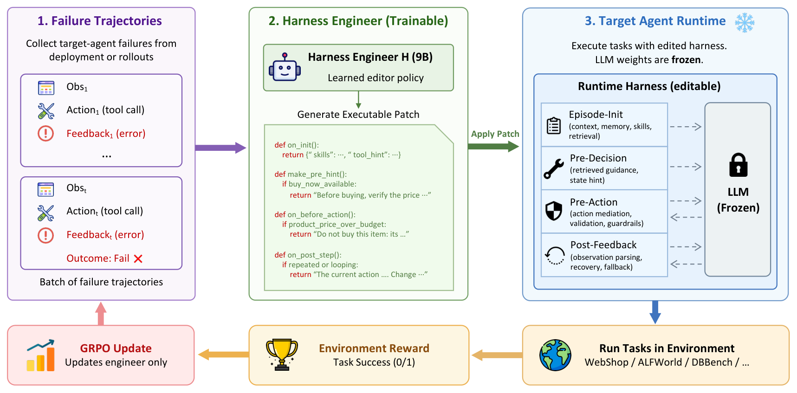
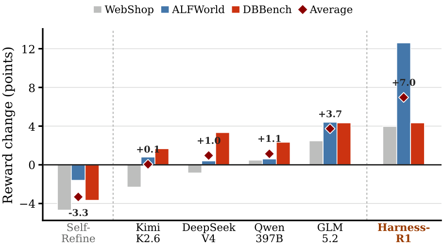
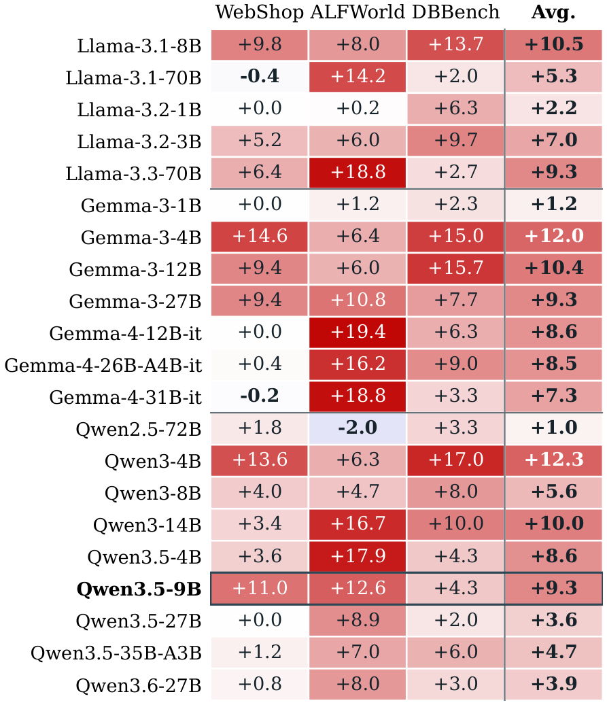
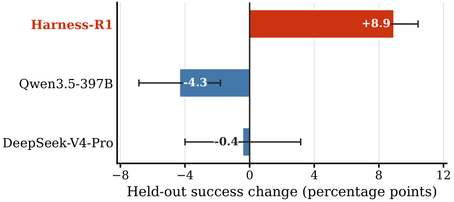
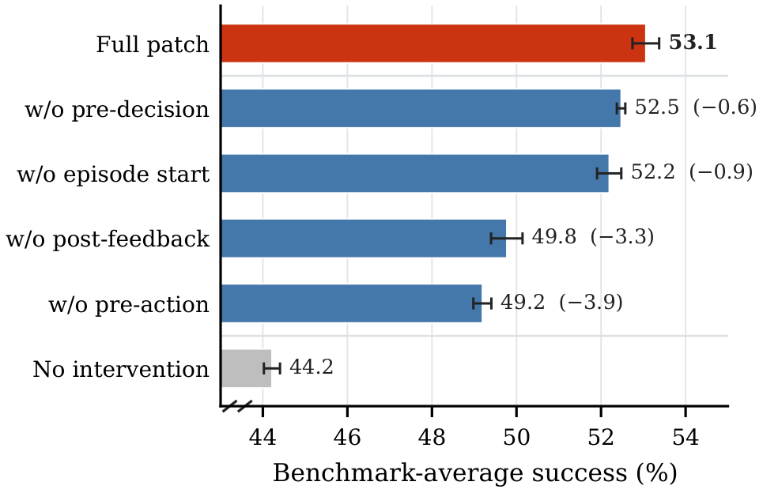

<div align="center">

# Harness-R1

**Learning to Edit Executable Runtime Harnesses from Agent Failure Trajectories**

[](#installation)
[](LICENSE)
[](#citation)
[](https://huggingface.co/ShaoShuai0605/Harness-R1)
[](#training)
[](#3-online-grpo)
[](docs/BENCHMARK_SETUP.md)

[Overview](#overview) ·
[Highlights](#highlights) ·
[Results](#results) ·
[Models](#model-checkpoints) ·
[Layout](#repository-layout) ·
[Installation](#installation) ·
[Evaluation](#evaluation) ·
[Training](#training) ·
[Docs](#documentation) ·
[Citation](#citation)

Shuai Shao<sup>1,2‡\*</sup>, Kangning Zhang<sup>1,2‡\*</sup>, Qingyao Li<sup>1,2\*</sup>, Shijian Wang<sup>3</sup>, Hao Wang<sup>2</sup>,<br>
Wenxiang Jiao<sup>2✉</sup>, Yuan Lu<sup>2✉</sup>, Yi Guo<sup>2</sup>, Weiwen Liu<sup>1✉</sup>, Weinan Zhang<sup>1✉</sup>

<sup>1</sup>Shanghai Jiao Tong University · <sup>2</sup>Xiaohongshu Inc. · <sup>3</sup>Southeast University<br>
<sub><sup>‡</sup>Equal contribution · <sup>\*</sup>Work done during internship at Xiaohongshu Inc. · <sup>✉</sup>Corresponding authors</sub>

</div>

## Overview

Harness-R1 trains a *harness engineer*: a model that reads a batch of failed
agent trajectories and writes a reusable runtime patch. The patch is validated,
compiled into sandboxed hooks, and scored by rerunning a frozen target agent on
exactly the same tasks.

<div align="center">
  
</div>

Agents built around large language models accumulate interaction trajectories
during deployment, yet their behavior typically stays fixed. Beyond updating
model weights, those trajectories can improve the **agent harness** — the runtime
that constructs context, mediates tools, validates actions, and recovers
execution. Harness-R1 makes failure-conditioned, lifecycle-wide editing of an
existing executable runtime a *learned* capability: a separate 9B engineer turns
batches of target-agent failures into validated executable patches, and
same-batch reruns of the frozen target supply the outcome reward, so training
updates only the engineer.

```text
frozen target rollout
  -> batch failure packet
  -> harness engineer
  -> <think>...</think><patch>...</patch>
  -> parse, validate, and sandbox hooks
  -> rerun the same target on the same task identities
  -> reward = patched metric - baseline metric
```

The only patch action is `add_code_hook`. A patch may define:

| Hook | Lifecycle position | Role |
|---|---|---|
| `on_init` | Episode initialization | Initialize notebook state and inject reusable skills/tool hints. |
| `make_pre_hint` | Pre-decision | Emit deduplicated soft guidance before the next action. |
| `on_before_action` | Pre-action | Narrowly allow, block, rewrite, or force an action when supported. |
| `on_post_step` | Post-feedback | Update notebook state after an environment step. |

See [docs/METHOD.md](docs/METHOD.md) and
[docs/PATCH_FORMAT.md](docs/PATCH_FORMAT.md).

## Highlights

- **Rewards come from real reruns, not a judge.** Every valid patch is compiled,
  installed, and scored by actually rerunning the frozen target on the same task
  identities. A well-formed patch is necessary but not sufficient.
- **Lifecycle-wide editing.** One patch can coordinate four intervention points
  around the frozen policy — episode init, pre-decision, pre-action, and
  post-feedback — instead of applying a single fixed pattern.
- **A trained 9B engineer beats much larger fixed editors.** 53.6% average versus
  48.8% for the strongest frontier editor (GLM-5.2) prompted on the same evidence.
- **The engineer co-evolves with the target.** Gains hold both before and after
  the target agent is fine-tuned: 44.3 → 53.6 on the vanilla target, and
  59.2 → 64.2 after direct agent SFT.
- **Transfers without retuning.** One learned editing policy improves all
  **20 unseen target agents** (+7.06 pp average) and **1,270 held-out tasks**.
- **Patches run sandboxed.** AST validation rejects imports, I/O, dynamic
  evaluation, unbounded loops, and benchmark leakage; execution is line- and
  time-bounded, and hook failures degrade to no effect rather than crashing.

## Results

Target: frozen Qwen3.5-9B. `Score` is the mean shaped WebShop reward, `Succ.` is
task success rate, and `Avg.` is the equal-weight average of WebShop Succ.,
ALFWorld All, and DBBench Succ. Full per-family breakdowns are in
**[docs/RESULTS.md](docs/RESULTS.md)**.

| Method | ALFWorld All | WebShop Score | WebShop Succ. | DBBench Succ. | **Avg.** |
|---|---|---|---|---|---|
| Qwen3.5-9B (default harness) | 40.6 | 66.0 | 31.2 | 61.0 | 44.3 |
| ReAct | 43.4 | 66.8 | 37.4 | 61.7 | 47.5 |
| Self-Refine | 39.0 | 61.7 | 29.0 | 57.3 | 41.8 |
| Reflection <sup>‡</sup> | 59.2 | 61.2 | 43.6 | 64.7 | 55.8 |
| Qwen3.5-397B | 41.2 | 66.4 | 32.8 | 63.3 | 45.8 |
| GLM-5.2 | 45.0 | 68.4 | 36.0 | 65.3 | 48.8 |
| Kimi-K2.6 | 41.4 | 63.7 | 31.8 | 62.7 | 45.3 |
| DeepSeek-V4-Pro | 41.0 | 65.1 | 32.4 | 64.3 | 45.9 |
| Gemini-3.5-Flash | 35.4 | 63.2 | 33.6 | 64.0 | 44.3 |
| GPT-5.5 | 43.2 | 61.4 | 36.6 | 64.0 | 47.9 |
| Supervised-only engineer | 39.4 | 67.8 | 38.6 | 61.3 | 46.4 |
| **Harness-R1** | 53.2 | 69.9 | 42.2 | 65.3 | **53.6** |
| Agent SFT | 71.2 | **71.5** | 42.6 | 63.7 | 59.2 |
| **Agent SFT + Harness-R1** | **84.0** | 68.7 | **43.0** | **65.7** | **64.2** |

<sup>‡</sup> Reflection uses a separate two-episode `success@2` protocol and is
not ranked against the single-episode rows.

Harness-R1 raises the frozen Qwen3.5-9B target from **44.3% to 53.6%** (+9.3 pp),
**7.1 pp above the supervised-only engineer** — which isolates what online RL
adds over cold-start SFT. After direct target-agent SFT, a target-specific
engineer lifts the stronger actor further, from **59.2% to 64.2%** (+5.0 pp).

<div align="center">
  
  <br><sub>Matched-baseline change in mean environment reward. Fixed editors are unreliable: Self-Refine <i>lowers</i> reward on all three benchmarks, and frontier editors hover near zero.</sub>
</div>

### Generalization across target agents

The learned editing policy is applied to targets never seen during training. Each
target supplies its own failure traces and receives newly generated patches, so
this measures transfer of the *editing policy*, not replay of a fixed patch.

Across **20 unseen targets** the benchmark-averaged gain is **+7.06 pp**, and
every target-level average is positive. Over the full 21 × 3 matrix, 56 of 63
target-benchmark combinations improve, four are unchanged, and the three
regressions are all ≤ 2.0 pp.

<div align="center">
  
</div>

### Held-out tasks and lifecycle positions

Given the **same 10 failures**, each engineer writes one patch that is applied to
all remaining tasks (1,270 held-out tasks, three matched seeds). Harness-R1 gains
**+8.9 ± 1.5 pp** and is positive on every seed, while both frontier engineers
average negative and straddle zero. Disabling one lifecycle position at a time
shows pre-action mediation (−3.9) and post-feedback recovery (−3.3) dominate —
but *which* position dominates is environment-dependent, which is exactly what a
fixed strategy cannot decide on its own.

<div align="center">
  
  
</div>

## Model Checkpoints

Both harness engineers from the main results table are released in a single
repository: **[🤗 ShaoShuai0605/Harness-R1](https://huggingface.co/ShaoShuai0605/Harness-R1)**
(Qwen3.5-9B base, Apache-2.0).

| Subfolder | Paper row | Trained against |
|---|---|---|
| [`harness-r1`](https://huggingface.co/ShaoShuai0605/Harness-R1/tree/main/harness-r1) | Harness-R1 | The frozen vanilla Qwen3.5-9B target |
| [`agent-sft-harness-r1`](https://huggingface.co/ShaoShuai0605/Harness-R1/tree/main/agent-sft-harness-r1) | Agent SFT + Harness-R1 | The frozen agent-SFT Qwen3.5-9B target |

```python
from transformers import AutoTokenizer, AutoModelForCausalLM

REPO, SUBFOLDER = "ShaoShuai0605/Harness-R1", "harness-r1"
tokenizer = AutoTokenizer.from_pretrained(REPO, subfolder=SUBFOLDER, trust_remote_code=True)
model = AutoModelForCausalLM.from_pretrained(REPO, subfolder=SUBFOLDER, trust_remote_code=True)
```

Serve the chosen subfolder behind an OpenAI-compatible endpoint, point
`ENGINEER_BASE_URL` / `ENGINEER_MODEL` at it in
[`configs/eval/endpoints.env.example`](configs/eval/endpoints.env.example), then
follow [Evaluation](#evaluation). Keep `ENGINEER_CHAT_TEMPLATE_KWARGS` at
`{"enable_thinking":true}`: the engineer is decoded with the
`prefill_think_patch` protocol, where the chat template opens the assistant
`<think>` block and the model completes it before emitting exactly one `<patch>`
object.

> [!IMPORTANT]
> An engineer is only meaningful against the target it was trained for.
> `agent-sft-harness-r1` reproduces the `Agent SFT + Harness-R1` row **only** when
> the frozen target is the agent-SFT model; pointing it at a vanilla target is a
> different experiment. Target agents are not part of this release — build the
> agent-SFT target with
> [`configs/sft/qwen35_9b_agent_sft.example.yaml`](configs/sft/qwen35_9b_agent_sft.example.yaml),
> or serve any target you want to edit (the engineer transfers to unseen targets;
> see [cross-target results](docs/RESULTS.md#target-agent-generalization)).

## Repository Layout

```text
Harness-R1/
├── assets/                            figures from the paper
├── code/
│   ├── Relax/                         trimmed RL framework snapshot (upstream: redai-infra/Relax)
│   │   └── examples/harness_r1/       rewards, evaluators, dataset builders
│   └── life-harness/AgentBench/       task runtimes and code-hook execution
│       ├── scripts/                   patch protocol, trace packets, workers
│       └── src/server/harness/        sandboxed code_runner and per-benchmark hooks
├── configs/
│   ├── eval/endpoints.env.example     engineer/target endpoints and interpreters
│   ├── rl/mixed_codepatch.yaml        online RL reward and runtime configuration
│   └── sft/                           cold-start engineer SFT and agent SFT
├── docs/                              method, patch format, results, case studies, setup
├── examples/webshop_patch.json        a complete validated patch
├── scripts/                           launch and check wrappers
└── tests/                             protocol and sandbox unit tests
```

Neither benchmark assets, model weights, nor training data are bundled. See
[docs/BENCHMARK_SETUP.md](docs/BENCHMARK_SETUP.md) for how to install the
WebShop, ALFWorld, and DBBench environments.

## Installation

```bash
python -m venv code/life-harness/AgentBench/.venv
code/life-harness/AgentBench/.venv/bin/pip install -r \
  code/life-harness/AgentBench/requirements.txt

cp configs/eval/endpoints.env.example .env
# edit .env: engineer endpoint, frozen target endpoint, benchmark interpreters
set -a; source .env; set +a
```

Source-only checks (no endpoints or benchmark assets needed):

```bash
python scripts/check_release.py
```

## Evaluation

Evaluation is fixed-batch run-patch-rerun: read a prompt plus immutable
baseline metadata, generate one patch, validate it, rerun the frozen target on
the same tasks, and report patched minus baseline.

> [!IMPORTANT]
> The target server must return structured `message.tool_calls`. XML-looking tool
> text inside `message.content` is not equivalent and silently zeroes rewards.
> Probe before a long run:
>
> ```bash
> python scripts/probe_openai_tool_calls.py \
>   --base-url "$TARGET_BASE_URL" --model "$TARGET_MODEL"
> ```

Then run one of the wrappers with an input JSONL and an output directory:

```bash
bash scripts/eval_webshop.sh  /path/to/webshop_test.jsonl  outputs/webshop
bash scripts/eval_alfworld.sh /path/to/alfworld_test.jsonl outputs/alfworld
bash scripts/eval_dbbench.sh  /path/to/dbbench_test.jsonl  outputs/dbbench
```

Benchmark-specific environment variables (ALFWorld split and interpreter,
DBBench MySQL, and so on) are documented in
[docs/BENCHMARK_SETUP.md](docs/BENCHMARK_SETUP.md).

Patch generation and target rerun can be split, which is the correct protocol
for cross-target generalization:

```bash
GENERATE_ONLY=1 bash scripts/eval_webshop.sh INPUT OUT_GENERATED
PATCH_SOURCE_ROOT=OUT_GENERATED bash scripts/eval_webshop.sh INPUT OUT_RERUN
```

Valid patches whose rerun hit an infrastructure failure can be retried with
`RESUME=1 RESUME_RERUN_EVAL_FAILED=1`. An invalid patch is no-patch and scores
zero; an environment failure is a missing evaluation and must be reported
separately, never retried until it turns positive.

> [!IMPORTANT]
> WebShop results are reportable only when `webshop_goal_seed=233` and the strict
> `webshop_batch_identity_v1` task manifests agree between baseline and patched
> rerun. Matching integer task indices are **not** proof of a paired comparison.

## Training

Three model roles: a **target agent** that runs benchmark tasks and stays
frozen within a stage, the **harness engineer** being trained, and the frozen
**reference policy** used by GRPO. The reward is not a learned judge — every
valid patch is compiled and scored by an actual same-batch rerun.

All three stages below run on a single node with 8× NVIDIA H800 GPUs; record
counts for each stage are in [docs/RESULTS.md](docs/RESULTS.md#training-record-counts).

### 1. Cold-start SFT

Each SFT row has ordered `system`, `user`, `assistant` messages; the chat
template supplies the opening assistant `<think>\n` prefill and the target
continues that block and ends with a `<patch>` JSON object. Point
`configs/sft/qwen35_9b_engineer_coldstart.yaml` at your base model, dataset,
and output path, then run:

```bash
bash scripts/train_engineer_sft.sh
```

The reference setup is full SFT, 2 epochs, learning rate `1e-5`, cutoff length
32768, bfloat16, effective global batch size 24.

### 2. Build online-RL prompts

For each target stage: freeze the target checkpoint and serving options, run
no-harness trajectories on the training split, build batch failure packets, and
group records without mixing benchmarks inside a rollout group. Validation and
test task identities stay out of SFT and RL.

```bash
python code/Relax/examples/harness_r1/build_webshop_dataset.py --help
python code/Relax/examples/harness_r1/build_alfworld_dataset.py --help
python code/Relax/examples/harness_r1/build_dbbench_rl_dataset.py --help
python code/Relax/examples/harness_r1/build_grouped_mixed_rl_dataset.py --help
```

An RL row carries the prompt plus the immutable baseline metadata used by the
reward:

```json
{
  "prompt": [{"role": "system", "content": "..."}, {"role": "user", "content": "..."}],
  "label": "",
  "metadata": {
    "benchmark": "webshop",
    "batch_tag": "b0001",
    "start": 10, "end": 20, "batch_size": 10,
    "baseline_pass": 2,
    "baseline_rewards": {"10": 0.0},
    "target_model": "Qwen3.5-9B",
    "target_agent_name": "qwen35-9b-nothink"
  }
}
```

> [!WARNING]
> Never reuse baseline rewards produced by a different target model or serving
> protocol. SFT, RL, and evaluation must also agree on the exact system prompt,
> static user prefix and schema, `schema_style`, and the `prefill_think_patch`
> response protocol; changing the static protocol causes train/eval drift and
> sharply reduces format validity.

### 3. Online GRPO

Edit `configs/rl/mixed_codepatch.yaml` to point at the AgentBench and
benchmark interpreters, benchmark assets, a writable reward cache, and the
frozen target endpoint that produced the baseline JSONL. Then:

```bash
export QWEN35_HF=/path/to/engineer-sft-checkpoint
export HARNESS_R1_DATA=/path/to/grouped_rl.jsonl
export NUM_ROLLOUT=174
export HARNESS_R1_CONFIG="$PWD/configs/rl/mixed_codepatch.yaml"
export SAVE_PATH=/path/to/checkpoints
export CUDA_VISIBLE_DEVICES=0,1,2,3,4,5,6,7
bash scripts/train_engineer_rl.sh
```

Reference defaults: rollout batch size 4, 8 samples per prompt, global batch
size 32, 4 iterations per train update, rollout temperature/top-p 0.7/0.95, max
prompt/response 28672/12288, learning rate `1e-6`, no validity bonus, reward =
delta average reward. Use `ROLLOUT_SHUFFLE=0` for pre-grouped mixed data.

`reward_mixed_codepatch.py` dispatches on `metadata["benchmark"]` to the
WebShop, ALFWorld, or DBBench reward.

## Documentation

| Document | Contents |
|---|---|
| [docs/METHOD.md](docs/METHOD.md) | The failure → edit → rerun loop, runtime substrate, sandbox, reward |
| [docs/PATCH_FORMAT.md](docs/PATCH_FORMAT.md) | Patch JSON contract, hook return effects, validation rules |
| [docs/RESULTS.md](docs/RESULTS.md) | All paper tables: main, cross-target, held-out, ablation, splits |
| [docs/CASE_STUDIES.md](docs/CASE_STUDIES.md) | What generated patches do at runtime, including a failure case |
| [docs/BENCHMARK_SETUP.md](docs/BENCHMARK_SETUP.md) | Installing WebShop, ALFWorld, and DBBench environments |

## Release Roadmap

| Phase | Contents | Status |
|---|---|---|
| 1 | Training and evaluation code, patch protocol, sandbox, configs, docs | ✅ Available |
| 2 | Harness-engineer checkpoints for both main-table rows | ✅ Available |
| 3 | Public paper link and citation entry | ⏳ Planned |

## License

Harness-R1 code is released under Apache-2.0. Relax, AgentBench, and the
benchmark environments retain their original notices and licenses; see
[NOTICE](NOTICE).

## Citation

The paper does not yet have a public identifier. A BibTeX entry will be added
here once it does; until then, please cite this repository and the paper title:

```text
Harness-R1: Learning to Edit Executable Runtime Harnesses from Agent Failure Trajectories.
Shuai Shao, Kangning Zhang, Qingyao Li, Shijian Wang, Hao Wang,
Wenxiang Jiao, Yuan Lu, Yi Guo, Weiwen Liu, Weinan Zhang. 2026.
https://github.com/DeepExperience/Harness-R1
```
